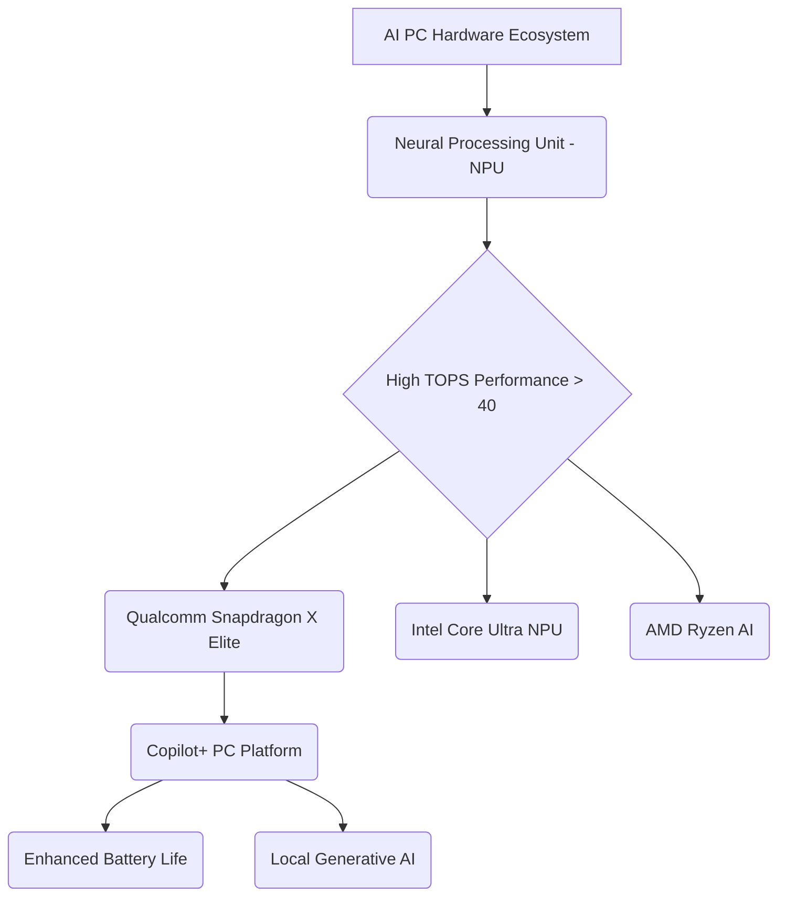

# AI PCs: Your Guide to the Next Generation of Laptops

## Introduction: The Dawn of the AI PC Era

We stand at the precipice of a fundamental shift in personal computing. For decades, the CPU (Central Processing Unit) and GPU (Graphics Processing Unit) have dictated the performance of our machines. Now, a third, critical chip has entered the arena: the **NPU** (Neural Processing Unit). This addition marks the birth of the **AI PC**, a truly **next-generation laptop** designed from the ground up to handle the intense demands of **on-device AI**.

The term **AI PC** is more than just marketing; it represents a new class of device optimized for tasks like real-time translation, advanced image generation, instant content summarization, and ultra-efficient video processing—all without relying on the cloud. These new machines promise dramatically improved battery life, superior performance in creative applications, and enhanced privacy thanks to **local AI processing**.

Leading the charge are powerful new devices like the **Copilot+ PC** lineup, spearheaded by Microsoft and chipmakers like Qualcomm with their groundbreaking **Snapdragon X Elite** processor.

If you’re wondering **what is an AI PC** or contemplating **should I buy an an AI PC** right now, this comprehensive guide is for you. We will dive deep into the hardware, explore the transformative software features like the **Microsoft Recall feature**, analyze the market landscape of the **best AI laptops 2024**, and detail the genuine **benefits of NPU** technology for everyday users and professionals alike.

## Defining the AI PC: More Than Just a Fast Laptop

An **AI PC** is fundamentally a computer built with dedicated hardware acceleration for Artificial Intelligence workloads. While current laptops can run AI tools (like using ChatGPT via a browser), an AI PC executes complex, large-language models (LLMs) and deep learning tasks directly and efficiently on the device itself.

The core differentiator is the presence of the **Neural Processing Unit (NPU)**.

### The Trinity of Modern Computing: CPU, GPU, and NPU

Traditionally, complex tasks were handled by the CPU (general computing) and the GPU (parallel processing, primarily graphics). The rise of machine learning necessitated a new, specialized component.

| Component | Primary Function | Traditional Tasks | AI PC Role |
| :--- | :--- | :--- | :--- |
| **CPU (Central Processing Unit)** | General instruction processing | Operating system, browser, spreadsheets | Managing overall system and orchestrating AI tasks. |
| **GPU (Graphics Processing Unit)** | Highly parallel processing | Gaming, 3D rendering, video editing | Training complex AI models, large-scale generative AI. |
| **NPU (Neural Processing Unit)** | Dedicated AI acceleration | AI-specific algorithms, neural network inference | Real-time voice processing, background effects, **on-device AI** features, low-power operation. |

The NPU’s strength lies in its ability to execute AI inferences—the application of a trained model—with incredible power efficiency. This efficiency is why **AI hardware acceleration** is key to achieving features like always-on voice commands and high-quality camera effects without draining the battery in minutes.

The industry consensus, largely driven by Microsoft’s requirements for a **Copilot+ PC**, is that a machine must have a minimum of **40 TOPS** (Tera Operations Per Second) of NPU performance to qualify as a true AI PC. This threshold is necessary to run Microsoft’s most powerful, local AI features.

## The Hardware Engine: Snapdragon X Elite and the NPU

The current wave of **AI PC** technology is heavily reliant on groundbreaking silicon, specifically the new class of chips designed around efficient AI processing.

### The Qualcomm Catalyst: Snapdragon X Elite

While Intel and AMD have also incorporated NPUs into their latest Core Ultra and Ryzen chips, the most significant leap has come from Qualcomm’s **Snapdragon X Elite** and **Snapdragon X Plus** platforms.

The **Snapdragon X Elite** stands out for its integrated NPU capable of delivering 45 TOPS of performance, easily exceeding Microsoft's requirement. This chip is the foundation for the initial wave of **Copilot+ PC** devices from manufacturers like Microsoft (Surface), Samsung (**Samsung Galaxy Book4 Edge**), Dell (**Dell XPS AI PC**), HP (**HP OmniBook AI**), and Lenovo (**Lenovo Yoga Slim AI**).

#### Snapdragon X Elite vs M3: A Performance Showdown

The narrative around the **future of computing** often centers on the competition between the Windows ecosystem and Apple. With the introduction of the Snapdragon X Elite, the performance gap between **Windows on ARM** and Apple's celebrated M-series chips is closing rapidly, especially in tasks leveraging the NPU.

Apple’s M-series chips (M1, M2, M3, etc.) have included powerful Neural Engines (Apple's NPU) for years, proving the viability of **on-device AI**. However, the X Elite marks a major milestone for Windows:

*   **Power Efficiency:** Both chips deliver phenomenal battery life compared to traditional x86 counterparts, thanks to their ARM architecture.
*   **AI Performance:** While Apple's Neural Engine is deeply integrated into macOS and optimized for tasks like Siri and machine learning filters, the X Elite’s 45 TOPS NPU performance is specifically tuned to run large, complex Windows-specific models (e.g., local Copilot functions).
*   **Application Compatibility (Windows on ARM):** The latest X Elite chips include sophisticated emulation layers that drastically improve the performance of non-native x86 applications, overcoming a major historical barrier for Windows on ARM.

### Understanding the Benefits of NPU

The integration of the NPU offers concrete, measurable improvements over older laptops:

1.  **Efficiency and Battery Life:** Moving routine AI tasks (like background noise cancellation or advanced security monitoring) off the power-hungry CPU/GPU saves significant power. The **benefits of NPU** are clearest when using video conferencing or real-time creative tools for extended periods.
2.  **Privacy and Security:** Since tasks like text summarization or facial recognition are handled via **local AI processing** on the NPU, the data never leaves the device. This is crucial for corporate compliance and user privacy, especially concerning sensitive data.
3.  **Performance and Responsiveness:** Dedicated hardware means AI features run instantly. Image generation, for example, can be executed locally in seconds, instead of relying on cloud latency.

[Related: https://blog.hifistudio.in/blog/energy-efficient-smart-homes-guide/]

***

`/image-topic.webp`

***

## The Software Revolution: Copilot+ PC Features

The hardware is only half the story. The **AI PC** experience is defined by new, native software capabilities that were impossible before the NPU became standard. Microsoft’s **Copilot+ PC** initiative outlines the essential features that define the new user experience.

### The Microsoft Recall Feature: A Searchable Memory

Perhaps the most discussed—and controversial—new capability is the **Microsoft Recall feature**. This function effectively gives the PC a photographic memory. It continuously takes snapshots of your screen activity (including apps, web pages, and documents) and uses **on-device AI** to index everything.

**How Recall Works:**

*   It uses the NPU to process the screen data locally.
*   It creates a semantic index, allowing you to search your history using natural language (e.g., "Find the hotel booking confirmation I looked at last Tuesday," or "Show me the blue shirt I saw on Amazon two days ago").
*   The data remains on your machine, leveraging **local AI processing** for privacy.

While initial concerns centered on privacy, the feature fundamentally changes how we interact with our computers, making context and history instantly accessible, transforming the **future of computing**.

### Next-Level Creativity and Communication Tools

Beyond Recall, **Copilot Plus features** introduce practical AI enhancements to everyday apps:

#### 1. Live Captions and Translation
Using the NPU, **AI-powered laptops** can translate and transcribe audio in real-time, even in offline scenarios. This is invaluable for international business meetings or for improving accessibility.

#### 2. Advanced Studio Effects
AI Studio Effects use the NPU for sophisticated, low-latency video enhancements, such as:
*   **Automatic Framing:** Keeping the user centered during video calls.
*   **Teleprompter:** Maintaining eye contact with the camera while reading notes.
*   **Background Blur and Stylization:** High-quality depth effects without the typical performance hit.

#### 3. Generative AI on PC
Local LLMs allow for instant, dedicated **generative AI on PC**. This means you can:
*   Generate images using tools like Cocreator in Paint, modifying them instantly with text prompts or brushstrokes.
*   Summarize long documents or emails directly within Office applications using Copilot, without transmitting data to the cloud.

These capabilities position the **AI PC for creatives** and knowledge workers who need instant access to powerful tools without cloud constraints.

***

`/image-topic.webp`

***

## The Competitive Landscape: Windows on ARM Meets Apple Intelligence

The AI PC market is a fierce battleground where hardware efficiency meets software innovation. The primary competitors are Microsoft/Qualcomm and Apple.

### Windows on ARM: The Rebirth

The success of the **AI PC** is intrinsically linked to the maturity of **Windows on ARM**. Previous attempts to transition Windows to the ARM architecture failed primarily due to weak performance and poor x86 application emulation.

The **Snapdragon X Elite** has solved the performance problem. Microsoft has simultaneously introduced Prism, a powerful new emulation layer, ensuring that legacy applications run smoothly. This is a game-changer, giving the Windows ecosystem the power efficiency of ARM alongside the comprehensive feature set of Windows.

### Apple Intelligence and the M-Series Advantage

Apple didn't wait for the AI PC term to be coined; their M-series chips were already AI PCs. Their Neural Engine has been accelerating machine learning tasks since 2020. With the announcement of **Apple Intelligence**, Apple formalized its commitment to deeply integrated, personal AI across macOS, iOS, and iPadOS.

Apple’s approach emphasizes "Personal Intelligence," using the on-device NPU for tasks like:

*   Rewriting and proofreading text with deep context.
*   Prioritizing notifications and emails intelligently.
*   Generating images and Genmoji (custom emojis) locally.
*   A deeper integration with their voice assistant, Siri.

The key difference remains the software ecosystem. While Windows focuses on Copilot and generalized tasks, Apple uses the deep vertical integration of its hardware and software to create a highly personalized, secure AI experience.

[Related: https://blog.hifistudio.in/blog/best-ai-personal-assistants-productivity/]

## Practical Use Cases: Who Needs an AI PC?

While every new laptop will likely be an AI PC going forward, certain users will benefit most immediately from the dedicated hardware acceleration.

### AI PC for Creatives

For designers, photographers, and videographers, the NPU significantly speeds up workflows:

*   **Adobe Suite:** Programs like Photoshop and Premiere Pro are increasingly offloading tasks (e.g., sky replacement, noise reduction, motion tracking) to the NPU for near-instant results.
*   **3D Modeling:** Complex scene rendering and optimization can leverage the combined power of the NPU and GPU, reducing render times.
*   **Generative Art:** Running Stable Diffusion models locally provides better control, privacy, and faster iteration than relying on cloud APIs.

### AI PC for Developers and Data Scientists

Developers working with machine learning models and large datasets gain substantial advantages:

*   **Local Model Testing:** Running small to medium-sized LLMs locally using **local AI processing** allows for faster development, debugging, and iteration without high cloud computing costs.
*   **Code Assistants:** AI coding companions can run inference more efficiently, offering faster, more relevant code suggestions and context awareness.
*   **Virtualization:** Optimized virtualization layers on **Windows on ARM** improve cross-platform development for those working with different operating systems.

### AI PC for the Hybrid Professional

The typical remote or hybrid worker sees massive battery life gains and enhanced communication quality:

*   **Superior Video Conferencing:** Consistent, high-quality camera and audio effects that don't bog down the CPU or drain the battery during long video calls.
*   **Instant Summaries:** Using **Copilot Plus features** to instantly summarize long meeting transcripts or catch up on threads in Teams or Outlook.
*   **Enhanced Security:** The NPU assists in local security features, such as advanced biometric authentication and real-time threat detection, improving device safety in the age of hybrid work.

[Related: https://blog.hifistudio.in/blog/ai-revolutionizes-content-creation-ultimate-guide/]

## Buying Guide: The Best AI Laptops 2024

If the time has come for an upgrade, the market is quickly filling with high-performing **AI-powered laptop** models, largely based on the new Snapdragon X Elite platform or high-end Intel/AMD NPUs.

### Key Considerations Before Buying

1.  **NPU TOPS:** Look for 40 TOPS or higher for guaranteed access to the full suite of **Copilot Plus features** and advanced **on-device AI**.
2.  **RAM:** AI models are memory-intensive. 16GB of unified memory is the minimum recommendation, with 32GB being ideal for power users and creatives.
3.  **Storage:** While less critical for AI processing itself, look for fast SSD storage (NVMe) to handle the large files associated with **generative AI on PC**.

### Top AI PC Models of 2024

| Model Name | Key Processor/NPU | Standout Feature | Target Audience |
| :--- | :--- | :--- | :--- |
| **Microsoft Surface AI** (Laptop/Pro) | Snapdragon X Elite | Deepest integration with Windows/Copilot, premium build. | Early adopters, Microsoft ecosystem users. |
| **Samsung Galaxy Book4 Edge** | Snapdragon X Elite | Exceptional AMOLED display, ultra-thin design, great battery life. | Professionals needing portability and display quality. |
| **Dell XPS AI PC** (Latest iteration) | Intel Core Ultra / Snapdragon X Elite options | High-end components, sleek industrial design, powerful GPU options. | Creatives and developers who need top performance. |
| **HP OmniBook AI** | Snapdragon X Elite | Designed for enterprise and hybrid work, solid security features. | Corporate users and students focused on reliability. |
| **Lenovo Yoga Slim AI** | Intel Core Ultra / Snapdragon X Elite options | Versatility (convertible 2-in-1), excellent keyboard, and focus on collaborative tools. | Flexible workers and content consumers. |

These machines represent the vanguard of the market, offering efficient performance and access to the full suite of AI capabilities necessary for the **future of computing**.

***

`/image-topic.webp`

***

## Deep Dive: The Evolution of AI Hardware Acceleration

The journey to the NPU wasn't sudden. It represents years of refinement in specialized chip architecture. Understanding this evolution helps clarify why the **AI PC** is a necessary technological step, not a fad.

### From Cloud Dependence to Edge Computing

For years, the majority of powerful AI tasks—like training a complex LLM—were executed on massive, centralized servers in the cloud, often utilizing enormous GPU clusters. This approach had three major drawbacks: cost, latency, and data privacy.

The shift to **on-device AI** is part of the larger trend of **edge computing**. By bringing the computational power closer to the user (i.e., onto the laptop itself), the **AI PC** addresses these issues head-on. The NPU acts as the specialized, hyper-efficient "edge" processor, allowing routine AI features to run instantly and privately.

### Semantic SEO and the AI PC

In the context of the AI PC, the term "semantic SEO" takes on a new meaning. Not only does the NPU help the PC understand *your* context (via features like Recall), but the power of the NPU enables better interaction with data.

For digital marketers and content creators, the AI PC means running advanced natural language processing models locally to analyze content performance or draft large bodies of text, offering significant time savings. This local, personalized approach to AI marks a definitive departure from the generic, server-side tools of the past.

[Related: https://blog.hifistudio.in/blog/ai-in-mental-health-revolutionizing-care-well-being/]

## Conclusion: Embracing the Future of Computing

The **AI PC** is here, and it is more than just a performance boost; it is a fundamental shift in how we interact with technology. Defined by the essential presence of the **NPU**, these **next-generation laptops**—led by the powerful **Copilot+ PC** lineup and processors like the **Snapdragon X Elite**—deliver unparalleled power efficiency, speed, and privacy through **local AI processing**.

Whether you are a developer looking for faster local model testing, a creative seeking instant **generative AI on PC** capabilities, or a general user eager for the transformative power of the **Microsoft Recall feature**, the **AI PC** offers a compelling reason to upgrade. The days of solely relying on the cloud for smart features are fading. The intelligence is moving onto your desk, making your computer faster, smarter, and uniquely tailored to your needs.

If you are currently researching the **best AI laptops 2024**, prioritize models with high NPU TOPS ratings. This investment secures your entry into the **future of computing**—a future where your device doesn't just run software, but anticipates and assists your every action.

***

## FAQs

### Q1. What is an AI PC?

An **AI PC** is a personal computer, typically a laptop, that includes a dedicated **Neural Processing Unit (NPU)** alongside the CPU and GPU. This specialized hardware provides high-efficiency **AI hardware acceleration**, allowing the PC to run complex machine learning and large-language models (LLMs) locally on the device, enabling new features like Microsoft Recall and real-time transcription.

### Q2. How is a Copilot+ PC different from a regular AI PC?

A **Copilot+ PC** is a specific designation created by Microsoft for **AI PCs** running Windows that meet stringent hardware requirements, including a minimum of 16GB of RAM and an NPU capable of at least 40 TOPS (Tera Operations Per Second) of performance. This guarantees the ability to run Microsoft’s most advanced **on-device AI** features, such as the **Microsoft Recall feature** and local Copilot capabilities.

### Q3. What is the NPU (Neural Processing Unit) and why is it important?

The **NPU** is a specialized microprocessor optimized for the parallel computations required by neural networks and machine learning algorithms. Its importance lies in power efficiency; it can run AI tasks far more efficiently than the CPU or GPU, leading to significantly better battery life and reduced latency when using **AI PC features** like background blurring or voice recognition.

### Q4. Does Apple have an AI PC equivalent?

Yes. Apple's M-series chips (M1, M2, M3, etc.) have included a specialized component called the Neural Engine, which functions as an NPU. While Apple doesn't use the "AI PC" or "Copilot+ PC" branding, these machines are fully capable of **on-device AI** and power the features announced under **Apple Intelligence**.

### Q5. What is the Microsoft Recall feature?

The **Microsoft Recall feature** is a **Copilot Plus feature** that uses the NPU to continuously index screenshots of your screen activity. This creates a searchable, semantic timeline of everything you've ever viewed or done on your PC. It relies entirely on **local AI processing** for enhanced privacy and allows users to search their history using natural language prompts.

### Q6. Should I buy an AI PC now, or wait?

If your current laptop is aged (4+ years) and you rely heavily on video conferencing, creative applications, or are intrigued by features like Recall and **generative AI on PC**, buying a current-generation **AI-powered laptop** (especially one with a Snapdragon X Elite or high-TOPS NPU) is highly recommended. The efficiency and new features offer a tangible upgrade over previous generations and set the standard for the **future of computing**.

### Q7. How does the Snapdragon X Elite compare to the M3 chip?

The **Snapdragon X Elite vs M3** comparison shows two highly efficient ARM-based chips. The X Elite offers a powerful 45 TOPS NPU, specifically optimized for the Windows **Copilot+ PC** ecosystem. While the M3 also has a powerful Neural Engine, the X Elite’s introduction brings competitive power efficiency and AI performance to the **Windows on ARM** platform, challenging Apple's long-held lead in ARM-based computing performance.